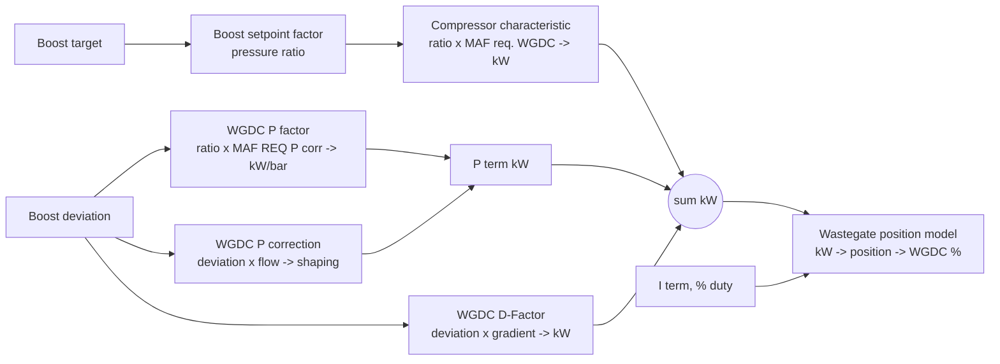

# Tuning the MG1CS201 boost controller from MHD logs

Living guide for the OEM Bosch boost control on the BMW B58 and S58 with the
MG1CS201 DME, as exposed by the MHD+ definitions. Kept next to the tool that
implements it, `motronic_autotuner/families/bosch_mg1cs201.py`. Edit this
file when the understanding changes; the tool follows it.

Last revised 2026-09-22.

## How the controller is built

The DME controls boost in units of **compressor power (kW)**, not duty
cycle. Duty is only the last step.



| Table in the XDF | Axes | Output | Log channels that index it |
| --- | --- | --- | --- |
| Compressor characteristic with required compressor / turbine power | x pressure ratio, y flow g/s | base power kW | Boost setpoint factor, MAF req. WGDC |
| WGDC P factor | x pressure ratio, y flow g/s | P gain kW per bar | Boost setpoint factor, MAF REQ (P corr.) |
| WGDC P correction | x boost deviation hPa, y flow g/s | shaping of the deviation | Boost deviation, MAF REQ (P corr.) |
| WGDC D-Factor | x boost deviation hPa, y deviation gradient hPa | D term kW | Boost deviation and its gradient |
| Wastegate Position - für Vorsteuerung | x power fraction, y flow g/s | wastegate position % | internal |

The P term is

```latex
P_{kW} = \text{Pfactor}(\text{ratio}, \text{flow}_{Pcorr}) \times \frac{\text{Pcorrection}(\text{deviation}, \text{flow}_{Pcorr})}{1000}
```

Running a log through both tables reproduces the logged P term with a
correlation of 0.98, sitting about 10 % low, which looks like the deviation
being filtered before it reaches the table. The P factor map is kW per bar of
shaped deviation; the correction map is the shaping.

The log carries every term: `Compressor base` (the characteristic lookup),
`Compressor after P-D` (base plus P plus D), `WGDC P-factor`, `WGDC D-factor`
in kW, `WGDC I-factor` in percent duty, `WGDC 1`, `MAF req. WGDC`,
`MAF REQ (P corr.)` and `Boost setpoint factor`. Deviation is target minus
actual: positive means under target.

## Order of operations

1. **Compressor table first.** In steady wide-open rows, the difference
   between `Compressor after P-D` and `Compressor base` is what P and I have
   been quietly adding. Fold it into the characteristic per cell and the
   feed-forward is right on its own. The tool's *Compressor feed-forward
   correction* generator does this.
2. **Relog.** The I term at steady state in each gear is the score: within
   plus or minus 1 % means the feed-forward is right.
3. **P correction map** next, for overshoot and slow settling. The findings
   below say where it is weak.
4. **P factor** last, only if anything is left.

Neither map touches the shift spike: that is the gearshift wastegate
handling, and it is also the main knock source seen in the logs.

## What the reference log showed

Log `2026-09-15 20_18_44 00005D55502807`, X5 40i, second to fifth gear pulls
at 12 Hz.

| Observation | Value |
| --- | --- |
| Feed-forward error in 71 steady rows above 3500 rpm, after P-D minus base | -0.24 kW |
| Steady I term | -1.15 % duty |
| Effective P gain from the log | 24.8 kW per bar |
| Overshoot in gears 3, 4, 5 | +0.25, +0.32, +0.65 bar |
| Undershoot in gear 2, first pull | -0.95 bar, slow spool |
| Operating flow at wide open | 300 to 470 g/s requested |

### Findings on the P correction map

- Its flow axis ends at 277.8 g/s, so every wide-open sample uses the bottom
  row: the shaping is identical everywhere the car operates.
- The negative side has no breakpoints between -50 and -500 hPa. The whole
  overshoot band, -60 to -260 hPa, is one straight line, a gain of about 1.8
  to 2.0. At the -216 hPa peak in fifth it predicts -5.3 kW against -8.6 kW
  logged: 10 to 17 % of a 50 kW base either way.
- The positive side dips: +10 gives 31.5, +30 gives 45.4, +50 gives 113. The
  slope collapses between 10 and 30 hPa and then triples. Anything settling
  around +20 to +35 hPa under target gets almost no P.
- The small-deviation zone, plus or minus 5 to 20 hPa, is fine at about 1.5 to 1.8.

### Edits proposed on 2026-09-22 (rev 1, not yet relogged)

- P correction, 277.8 row: breakpoints at -100, -200, -300 with values about
  -240, -500, -720, keeping -500 at -1045. Roughly +25 % authority in the
  overshoot band. Fix the +30 cell from 45.4 to about 78 so 10, 30, 50 runs
  31.5, 78, 113. Add a flow row near 400 g/s about 15 % larger on the negative
  side.
- P factor: leave alone except un-drooping the 277.8 and 347.2 rows, which
  fall 25 to 30 % from ratio 1.0 to 2.2 and above.
- Compressor table, 2.65 column: 30.6, 36.8, 46.6, 52.3 kW for the 305.6,
  347.2, 388.9, 444.4 rows. Rows at and above 277.8 rebuilt as
  constant-efficiency curves anchored at ratio 2.5; flow axis extended to
  500 g/s.

Expected feed-forward at the logged points after rev 1:

| Point | Old base kW | New base kW |
| --- | --- | --- |
| 2nd gear, 370 g/s, ratio 2.22 | 28.7 | 33.1 |
| 3rd early, 380 g/s, ratio 2.42 | 37.0 | 38.9 |
| 3rd to 4th top, 460 g/s, ratio 2.58 | 53.0 clamped | 51.1 |
| 5th steady, 450 g/s, ratio 2.60 | 53.7 clamped | 50.5 |

## What the 2026-09-23 stage 3 logs showed

Three logs from the G05 40i with the Turbosystems stage 3 turbo, 95 RON on
map 1, PRGID 00005D55465A09, 9.5 Hz, about 400 s in total with five wide-open
pulls in gears 2 to 6. The boost tables in the car's bin are unchanged from
the reference bin; only the timing maps were edited. Rev 1 above was not
flashed and, on this evidence, is not needed.

| Observation | Value |
| --- | --- |
| Boost against target in single-gear pulls (gears 3 to 5, 4500 to 6500 rpm) | within 0.05 bar |
| Spool in gear 4 from 3000 rpm, gate shut at 100 % duty | target reached 0.65 s after full pedal, overshoot 0.03 bar |
| Steady duty at 1.45 to 1.55 bar | 76 to 83 %, EWG 19 to 21 mm |
| Steady I term per gear | -0.6 to +0.5 % |
| Steady P term per gear | 0.0 to +0.5 kW |
| Feed-forward error, 17 cells, 250 to 444 g/s | -0.3 to +0.8 kW |
| P chain check on the RAM deviation channel | correlation 0.97, ratio 0.97 |
| Largest logged boost | 1.87 bar, charge pipe, during the 3rd to 6th gear shift |

The only large deviations sit inside gear changes: the transmission closes
the throttle to about 50 % for 0.3 s, charge-pipe pressure spikes 0.2 to 0.4
bar above target while manifold pressure stays on target, P goes to about
-5 kW and the gate opens. The controller is back within 0.05 bar about a
second after the shift. That is torque intervention, not a PID problem, so
the tool now ignores rows within 0.5 s of a gear change and requires the
throttle, not only the pedal, to be open.

Conclusion: with the OEM tables the stage 3 turbo is controlled well at
these targets. The compressor table corrections are within noise and can be
skipped. The targets themselves are the user's choice. Revisit the P tables
only if targets rise to where duty runs above 90 % steady.

Also seen: the logged P term follows "Boost deviation RAM" better than the
filtered "Boost deviation" (0.97 against 0.92 on the reference log), so log
the RAM variant.

## Relog protocol

20 Hz or faster. Same road and gears. Wide open from about 2000 rpm in each
gear. Channels: boost target RAM, boost, boost (mani), boost deviation RAM,
EWG position, WGDC, P, I and D factors, compressor base and after P-D,
MAF, MAF req. WGDC, MAF REQ (P corr.), boost setpoint factor, throttle,
pedal, gear, RPM, Load actual RAM, STFT 1, LTFT 1, Lambda 1, the six
cylinder timing corrections, Timing Cyl. 1 to 6, coolant, IAT, ambient
pressure, Status Torque limiter, Torque lim. 1, RF Max Index, TQ Max Index.
Boost target RAM and Boost target duplicate each other; Load act. is a
coarser twin of Load actual RAM. MHD lowers the rate as channels are added:
51 channels gave 9.5 to 12 Hz, so keep a shorter boost profile for pulls.

Before flashing an axis edit, check that TunerPro accepts axis changes on the
table and that the axis is stored with the resolution needed: some
definitions hold flow as integer g/s or ratio times 1000.

## What the tool does today

- Imports the four tables above plus the timing and fuel scalar maps from the
  XDF and bin.
- *Compressor feed-forward correction*: rows where the boost request is
  above 0.5 bar and the throttle above 70 % (both parameters), the
  deviation is within 0.05 bar (settled, parameter) and no gear change
  happened within 0.5 s; an optional minimum rpm, off by default. The
  accelerator pedal is not a condition: at half pedal the DME still
  requests boost. After-P-D minus base is averaged per cell on setpoint
  ratio by MAF req. WGDC (at least 2 samples, parameter) and added to the
  base table. Reports the steady P and I per gear as the score. When the
  log has no deviation channel it is calculated as target minus boost.
- *P chain check*: reproduces the logged P term from the P factor and P
  correction tables and reports the correlation and the median ratio, so a
  wrong axis or channel is caught before any edit.
- Rows within 0.5 s of a gear change (parameter) are ignored by the
  feed-forward and by the fuel scalar correction. The fuel scalar error is
  STFT plus LTFT when LTFT is logged, without fuel-cut rows (AFR above 16,
  parameter).

To fill the whole compressor table the logs must contain steady driving at
small boost targets: hold a part-throttle position that asks for 0.3 to
1.0 bar for several seconds at a time, in a high gear and at several engine
speeds. In the 2026-09-23 logs the target was either zero (3300 of 3840
rows) or a full-throttle 1.2 to 1.7 bar; the 130 part-throttle rows were
all tip-ins, so only 17 of 320 cells had data whatever the gates.

Planned: a boost response report per pull, with rise time, overshoot,
settling and oscillation, and guided scaling of the P correction and P
factor tables from those numbers. The MHD custom WGDC override path will be
added if the OEM path runs out of authority.
